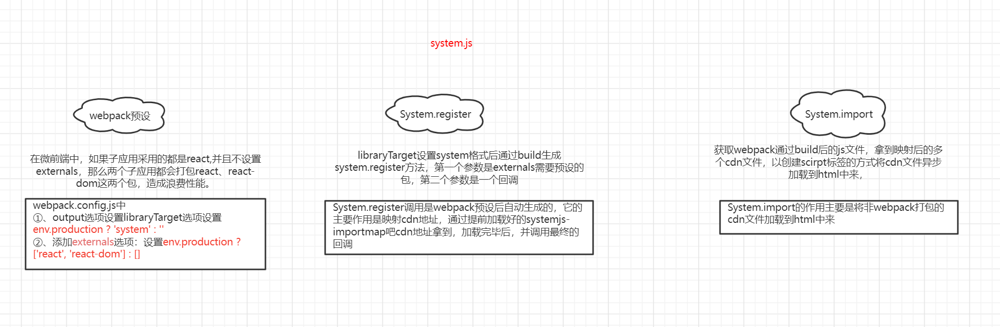
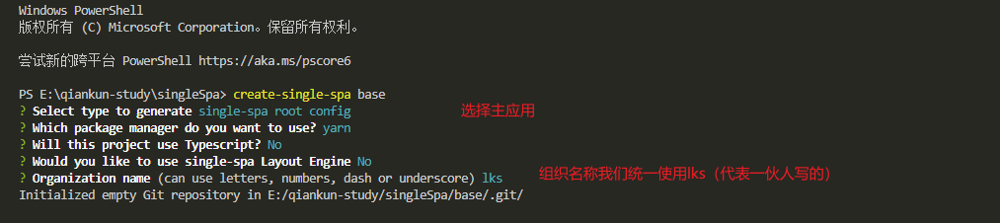
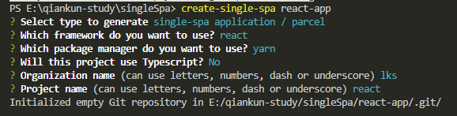
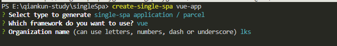
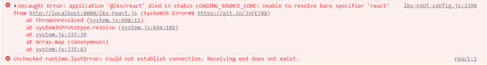
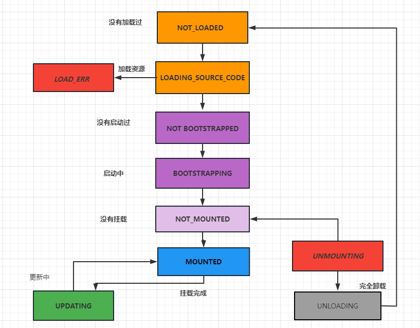

# 微前端

## 一、介绍

​	为了解决庞大的一整块后端服务带来的变更与扩展方面的限制，出现了[微服务架构](https://link.zhihu.com/?target=http%3A//www.ayqy.net/blog/%e5%be%ae%e6%9c%8d%e5%8a%a1%e6%9e%b6%e6%9e%84%ef%bc%88microservices%ef%bc%89/)

	微服务是面向服务架构（SOA）的一种变体，把应用程序设计成一系列松耦合的细粒度服务，并通过轻量级的通信协议组织起来
	具体地，将应用构建成一组小型服务。这些服务都能够独立部署、独立扩展，每个服务都具有稳固的模块边界，甚至允许使用不同的编程语言来编写不同服务，也可以由不同的团队来管理

​	然而，越来越重的前端工程也面临同样的问题，自然地想到了将微服务思想应用（照搬）到前端，于是有了「微前端（micro-frontends）」的概念：

​	**将前端应用分解成一些更小、更简单的能够独立开发、测试、部署的小块，而在用户看来仍然是内聚的单个产品**

### 1.1 为什么去使用它？

​	首先，我们需要知道它出现的背景，在学习前需要思考如下几个问题：

- 不同团队件开发同一个应用技术栈不同怎么破？

- 希望每个团队都可以独立开发，独立部署怎么破？

- 项目中还需要老的应用代码怎么破

  ```
  我们是不是可以将一个应用划分成若干个子应用，将子应用打包成一个个的lib。当路径切换时加载不同的子应用。这样每个子应用都是独立的，技术栈也不用做限制了。从而解决了前端协同开发问题。
  ```

### 1.2 与iframe的区别？

1. url 不同步。浏览器刷新 iframe url 状态丢失、后退前进按钮无法使用。
2. UI 不同步，DOM 结构不共享。想象一下屏幕右下角 1/4 的 iframe 里来一个带遮罩层的弹框，同时我们要求这个弹框要浏览器居中显示，还要浏览器 resize 时自动居中..
3. 全局上下文完全隔离，内存变量不共享。iframe 内外系统的通信、数据同步等需求，主应用的 cookie 要透传到根域名都不同的子应用中实现免登效果。
4. 慢。每次子应用进入都是一次浏览器上下文重建、资源重新加载的过程。

### 1.3 微前端解决的问题

- 不同团队（技术栈不同），同时开发一个应用
- 每个团队开发的模块都可以独立开发，独立部署

### 1.4 如何实现微前端

我们可以将一个应用划分成多个若干个子应用，将子应用打包成一个个的模块。当路径切换加载不同的子应用，这样每个子应用都是独立的，技术栈也不用做限制了！从而解决了前端协同开发问题。（子应用需要暴露固定的钩子bootstrap、mount）

- `iframe`、`webComponent`
- 2018年`Single-spa`诞生了，`Single-spa`是一个用于前端微服务化的`JavaScript`前端解决方案（本身没有处理样式隔离，js执行隔离）实现了路由劫持和应用加载
- 2019年`qiankun`基于Single-spa，提供了更加开箱即用的`API`(`single-spa`+`sandbox`+`import-html-entry`)做到了技术栈无关、并且介入简单（像`iframe`一样简单）
- 2020年`EMP`基于module Federation, 接入成本低，解决第三方依赖包的问题。

```markdown
总结：子应用可以独立构建，运行时动态加载，主子应用完全解耦，技术栈无关，靠的是协议介入（子应用必须导出bootstrap、mount、unmount方法）
```

> 拓展：微前端与iframe的区别？
>
> ​	iframe的子应用切换路由时用户刷新页面会切换到原有的页面去

## 二、System.js

`SystemJs`是一个通用的模块加载器，它能在浏览器上动态加载模块。微前端的核心就是加载微应用，我们将一个个应用打包成模块，在浏览器中通过SystemJs来加载模块。下文所讲的Single-spa也是用到了System.js进行动态加载模块的。具体用法如下↓↓↓

```html
<script src="system.js"></script>
<script>
	SystemJS.import('./index.js')
</script>
```

  systemJs模块加载的流程↓

1. 先请求获取远程cdn文件模块，systemjs 才有了 直接请求的方式， 然后文件解析后会直接挂载在全局对象上面 window/global 
2. 遍历全局变量，拿最新插入的属性，这样就能提取



## 三、Single-Spa实战

> [single-spa](https://zh-hans.single-spa.js.org/docs/getting-started-overview)是一个将多个单页面应用聚合为一个整体应用的 JavaScript 微前端框架。使用 single-spa 进行前端架构设计可以带来很多好处，例如↓
>
> - 在同一页面上[使用多个前端框架](https://zh-hans.single-spa.js.org/docs/ecosystem#help-for-frameworks) [而不用刷新页面](https://zh-hans.single-spa.js.org/docs/building-applications) ([React](https://zh-hans.single-spa.js.org/docs/ecosystem-react), [AngularJS](https://zh-hans.single-spa.js.org/docs/ecosystem-angularjs), [Angular](https://zh-hans.single-spa.js.org/docs/ecosystem-angular), [Ember](https://zh-hans.single-spa.js.org/docs/ecosystem-ember), 你正在使用的框架)
> - 独立部署每一个单页面应用
> - 新功能使用新框架，旧的单页应用不用重写可以共存
> - 改善初始加载时间，延迟加载代码

### 3.1 安装

#### 3.1.1 全局安装single-spa

```bash
npm i create-single-spa -g
```

#### 3.1.2 接着安装基座

```bash
create-single-spa base
```

#### 

#### 3.1.3 创建子应用

生成react子应用

```bash
create-single-spa react-app
```



生成vue子应用

```bash
create-single-spa vue-app
```



### 3.2 启动子应用

#### 3.2.1 启动vue

1. 对于`vue`项目，先改写vue.config.js，之后通过命令`yarn serve`启动即可

   ```js
   const { defineConfig } = require('@vue/cli-service');
   module.exports = defineConfig({
   	transpileDependencies: true,
   +	devServer: {
   +		port: 3000,
   +	},
   +   configureWebpack: {
   +       output: {
   +         libraryTarget: 'system',
   +       },
   +    },
   });
   ```

   <font color="#f00">注意：有且仅有`vue`应用需要添加`configureWebpack`选项，否则会报错！！！</font>

2. 对于react项目，需要更改`webpack.config.js`之后再通过命令`yarn start`启动即可。

   ```js
   module.exports = (webpackConfigEnv, argv) => {
     ...
     return merge(defaultConfig, {
   +   output: {
   +     libraryTarget: 'system'
   +   },
   + });
   };
   ```

   

### 3.3 编辑基座

1. 先编辑`index.ejs`文件，配置如下

   ```ejs
   <script type="systemjs-importmap">
       {
         "imports": {
           "single-spa": "https://cdn.jsdelivr.net/npm/single-spa@5.9.0/lib/system/single-spa.min.js",
   +       "react": "https://cdn.jsdelivr.net/npm/react@16.13.1/umd/react.production.min.js",
   +       "react-dom": "https://cdn.jsdelivr.net/npm/react-dom@16.13.1/umd/react-dom.production.min.js"
         }
       }
     </script>
   ```

   <font color="#f00">注意：上面的代码一定要加入`react`和`reac-dom`这两个cdn ，如果不加，在加载`react`子应用的时候，会出现如下错误</font>

   

   接着我们再编辑下面的代码，增加两个路径地址↓

   ```ejs
   <% if (isLocal) { %>
       <script type="systemjs-importmap">
       {
         "imports": {
           "@single-spa/welcome": "https://unpkg.com/single-spa-welcome/dist/single-spa-welcome.js",
           "@lks/root-config": "//localhost:9000/lks-root-config.js",
   +       "@lks/vue": "//localhost:3000/js/app.js",
   +       "@lks/react": "//localhost:8080/lks-react.js"
         }
       }
     </script>
   <% } %>
   ```

2. 编辑`microfrontend-layout.html`文件，增加地址导航，

   ```ejs
   <single-spa-router>
     <!--
   
       This is the single-spa Layout Definition for your microfrontends.
       See https://single-spa.js.org/docs/layout-definition/ for more information.
   
     -->
   
     <!-- Example layouts you might find helpful:
   
     <nav>
       <application name="@org/navbar"></application>
     </nav>
     <route path="settings">
       <application name="@org/settings"></application>
     </route>
   
     -->
   
     <main>
       <route default>
         <application name="@single-spa/welcome"></application>
       </route>
   +   <route path="vue">
   +     <application name="@lks/vue"></application>
   +   </route>
   +   <route path="react">
   +     <application name="@lks/react"></application>
   +   </route>
     </main>
   </single-spa-router>
   ```

   至此，一个基于single-spa的微前端应用就跑起来了~

## 四、Single-spa源码解读

### 4.1核心流程解读

首先，`single-spa`的两个核心API`registerApplication`和`start`方法，registerApplication方法主要负责app应用的收集，start

```html
<!DOCTYPE html>
<html lang="en">

<head>
    <meta charset="UTF-8">
    <meta http-equiv="X-UA-Compatible" content="IE=edge">
    <meta name="viewport" content="width=device-width, initial-scale=1.0">
    <title>构建微前端</title>
</head>

<body>
    <a href="#/a">a应用</a>
    <a href="#/b">b应用</a>
    <!-- <script src="/lib/umd/single-spa.js"></script> -->
    <!-- 需要把包变成umd，其他的会报错 -->
    <script src="https://cdn.bootcdn.net/ajax/libs/single-spa/5.9.4/umd/single-spa.dev.min.js"></script>
    <script>
        const { registerApplication, start } = singleSpa
        // 参数 1) 注册应用的名字
        const app1 = {
            bootstrap: [async (props) => { // bootstrap的三个函数是同时执行的,并且只会在启动的时候执行一次，后面切回来不再执行
                console.log('aaa项目启用了1~~~~');
            }, async (props) => {
                console.log('aaa项目启用了2~~~~');
            }, async (props) => {
                console.log('aaa项目启用了3~~~~');
            }],
            mount: async (props) => { console.log('app1挂载~'); },     // 挂载状态
            unmount: async (props) => { console.log('app1已卸载'); },   // 卸载状态
        }
        const app2 = {
            bootstrap: [async (props) => {
                console.log('bbb项目启用了1~~~~');
            }, async (props) => {
                console.log('bbb项目启用了2~~~~');
            }, async (props) => {
                console.log('bbb项目启用了3~~~~');
            }],
            mount: async (props) => { console.log('app2挂载~'); },     // 挂载状态
            unmount: async (props) => { console.log('app2已卸载'); },   // 卸载状态
        }

        registerApplication(
            'app1',
            async (props) => app1,
            location => location.hash.startsWith('#/a'), // 激活规则
            {
                store: { name: '张三', age: 18 } // 注册应用的时候可以传递参数
            }
        )
        registerApplication(
            'app2',
            async (props) => app2,
            location => location.hash.startsWith('#/b'), // 激活规则
            {
                store: { name: '张三', age: 18 } // 注册应用的时候可以传递参数
            }
        )

        start(); // 启动这个应用

        // registerApplication 默认会加载应用
        // start时会挂载应用
    </script>
</body>

</html>
```

### 4.2 应用加载状态



TODO。。。

## 五、qiankun实战

### 5.1 介绍

> qiankun 是一个基于 [single-spa](https://github.com/CanopyTax/single-spa) 的[微前端](https://micro-frontends.org/)实现库，旨在帮助大家能更简单、无痛的构建一个生产可用微前端架构系统。

qiankun的特性如下↓

- 📦 **基于 [single-spa](https://github.com/CanopyTax/single-spa)** 封装，提供了更加开箱即用的 API。
- 📱 **技术栈无关**，任意技术栈的应用均可 使用/接入，不论是 React/Vue/Angular/JQuery 还是其他等框架。
- 💪 **HTML Entry 接入方式**，让你接入微应用像使用 iframe 一样简单。
- 🛡 **样式隔离**，确保微应用之间样式互相不干扰。
- 🧳 **JS 沙箱**，确保微应用之间 全局变量/事件 不冲突。
- ⚡️ **资源预加载**，在浏览器空闲时间预加载未打开的微应用资源，加速微应用打开速度。
- 🔌 **umi 插件**，提供了 [@umijs/plugin-qiankun](https://github.com/umijs/plugins/tree/master/packages/plugin-qiankun) 供 umi 应用一键切换成微前端架构系统。

### 5.2 安装

```bash
 yarn add qiankun # 或者 npm i qiankun -S
```

TODO...

## 六、qiankun源码解读

## 七、CSS隔离方案

> 首先什么是css隔离？

**CSS隔离是将CSS样式通过特殊方法安置在独立环境中，暂时避免和其他CSS污染。**

### 7.1 子应用之间的样式隔离

`Dynamic Stylesheet`动态样式表，当应用切换时移除老应用样式，添加新应用样式。

### 7.2 主应用和子应用之间的样式隔离

通常有4中解决方案，都能更好的实现css隔离的需求。

- `BEM`(Block Element Modifier)约定项目前缀
- `CSS-Modules`打包时生成不冲突的选择器名
- `Shadow DOM`真正意义上的隔离
- `css-in-js` 使用 JS 语言写 CSS,facebook剔除
